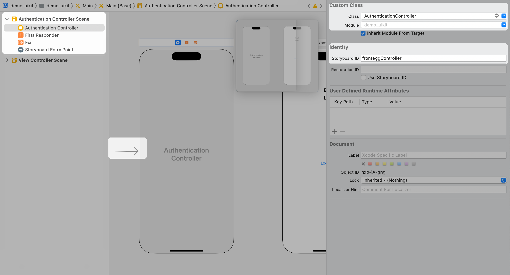

Welcome to the @frontegg/ios Swift SDK! This SDK provides a seamless way to integrate Frontegg's authentication and user management capabilities into your iOS applications.


## Table of Contents

- [Project Requirements](#project-requirements)
  - [Supported Languages](#supported-languages)
  - [Supported Platforms](#supported-platforms)
- [Getting Started](#getting-started)
  - [Prepare Frontegg workspace](#prepare-frontegg-workspace)
  - [Setup Hosted Login](#setup-hosted-login)
  - [Add frontegg package to the project](#add-frontegg-package-to-the-project)
  - [Create Frontegg plist file](#create-frontegg-plist-file)
  - [SwiftUI Integration](#swiftui-integration)
    - [Add Frontegg Wrapper](#add-frontegg-wrapper)
    - [Add custom loading screen](#Add-custom-loading-screen)
  - [UIKit Integration](#uikit-integration)
    - [Add Frontegg UIKit Wrapper](#add-frontegg-uikit-wrapper)
    - [Add custom UIKit loading screen (coming-soon)](#Add-custom-uikit-loading-screen)
  - [Embedded Webview vs ASWebAuthenticationSession](#embedded-webview-vs-aswebauthenticationsession)
  - [Config iOS associated domain](#config-ios-associated-domain)
  - [Multi-apps Support](#multi-apps-support)
  - [Multi-Region support](#multi-region-support)
  - [Login with ASWebAuthenticationSession](#login-with-aswebauthenticationsession)
  - [Passkeys Authentication](#passkeys-authentication)
  - [FronteggAuth methods](#fronteggauth-methods)
  - [Step-Up](#step-up)

## Project Requirements

### Supported Languages

**Swift:** The minimum supported Swift version is now 5.3.

### Supported Platforms

Major platform versions are supported, starting from:

- iOS **> 14**

## Getting Started

### Prepare Frontegg workspace

Navigate to [Frontegg Portal Settings](https://portal.frontegg.com/development/settings), If you don't have application
follow integration steps after signing up.
Copy FronteggDomain to future steps
from [Frontegg Portal Domain](https://portal.frontegg.com/development/settings/domains)

### Setup Hosted Login

- Navigate to [Login Method Settings](https://portal.frontegg.com/development/authentication/hosted)
- Toggle Hosted login method
- Add `{{IOS_BUNDLE_IDENTIFIER}}://{{FRONTEGG_BASE_URL}}/ios/oauth/callback`
- Add `{{FRONTEGG_BASE_URL}}/oauth/authorize`
- Replace `IOS_BUNDLE_IDENTIFIER` with your application identifier
- Replace `FRONTEGG_BASE_URL` with your frontegg base url

### Add frontegg package to the project

- Open you project
- Choose File -> Add Packages
- Enter `https://github.com/frontegg/frontegg-ios-swift` in search field
- Press `Add Package`

### Create Frontegg plist file

To setup your SwiftUI application to communicate with Frontegg, you have to create a new file named `Frontegg.plist`
under
your root project directory, this file will store values to be used variables by Frontegg SDK:

```xml
<?xml version="1.0" encoding="UTF-8"?>
<!DOCTYPE plist PUBLIC "-//Apple//DTD PLIST 1.0//EN">
<plist version="1.0">
    <dict>
        <key>baseUrl</key>
        <string>https://[DOMAIN_HOST_FROM_PREVIOUS_STEP]</string>
        <key>clientId</key>
        <string>[CLIENT_ID_FROM_PREVIOUS_STEP]</string>
    </dict>
</plist>
```

### SwiftUI integration

- ### Add Frontegg Wrapper

  - To use Frontegg SDK you have to wrap you Application Scene with FronteggWrapper
      ```swift
    
      import SwiftUI
      import FronteggSwift
    
      @main
      struct demoApp: App {
          var body: some Scene {
              WindowGroup {
                  FronteggWrapper {
                      MyApp()
                  }
              }
          }
      }
      ```
  - Modify `MyApp.swift` file to render content if user is authenticated:
    1. Add `@EnvironmentObject var fronteggAuth: FronteggAuth` to
    2. Render your entire application based on `fronteggAuth.isAuthenticated`

    ```swift
    struct MyApp: View {
      @EnvironmentObject var fronteggAuth: FronteggAuth
      
      var body: some View {
        ZStack {
          if fronteggAuth.isAuthenticated {
            [YOU APPLICATION TABS / ROUTER / VIEWS]
          } else  {
            
            Button {
                fronteggAuth.login()
            } label: {
                Text("Login Button")
            }
          }
        }
      }
    }
    ```

  - ### Add custom loading screen

  To use your own `LoadingView` / `SplashScreen`:

  - Build your loading view in separated file
  - Pass `LoadingView` as AnyView to the FronteggWrapper
    ```swift
    FronteggWrapper(loaderView: AnyView(LoaderView())) {
      MyApp()
    }
    ```

### UIKit integration

- ### Add Frontegg UIKit Wrapper
  - Add Frontegg to the AppDelegate file
    ```swift
      func application(_ application: UIApplication, didFinishLaunchingWithOptions launchOptions: [UIApplication.LaunchOptionsKey: Any]?) -> Bool {
          // Override point for customization after application launch.
    
          FronteggApp.shared.didFinishLaunchingWithOptions()
        
          return true
      }
    ```
  - Create AuthenticationController class that extends AbstractFronteggController from FronteggSwift
    ```swift 
      //
      //  AuthenticationController.swift
      //
      
      import UIKit
      import FronteggSwift
      
      class AuthenticationController: AbstractFronteggController {
      
          override func navigateToAuthenticated(){
              // This function will be called when the user is authenticated
              // to navigate your application to the authenticated screen
              
              let mainStoryboard: UIStoryboard = UIStoryboard(name: "Main", bundle: nil)
              
              // TODO: Set Storyboard ID 'authenticatedScreen' for your authenticated screen
              let viewController = mainStoryboard.instantiateViewController(withIdentifier: "authenticatedScreen")
              self.view.window?.rootViewController = viewController
              self.view.window?.makeKeyAndVisible()
          }
      
      }
    ```
  - Create a new ViewController for AuthenticationController:
    1. Change viewController's class to `AuthenticationController`
    2. Set Storyboard ID to `fronteggController`
    3. Make sure that the view controller is the initial view controller
       

  - Setup SceneDelegate for Frontegg universal links:
      ```swift
        func scene(_ scene: UIScene, openURLContexts URLContexts: Set<UIOpenURLContext>) {
            if let url = URLContexts.first?.url,
                url.startAccessingSecurityScopedResource() {
                defer  {
                    url.stopAccessingSecurityScopedResource()
                }
                if url.absoluteString.hasPrefix( FronteggApp.shared.baseUrl ) {
                    if(FronteggApp.shared.auth.handleOpenUrl(url)){
                        // Display your own Authentication View Controller
                        // to handle after oauth callback
                        window?.rootViewController = AuthenticationController()
                        window?.makeKeyAndVisible()
                        return
                    }
                }
                
            }
        }
        func scene(_ scene: UIScene, continue userActivity: NSUserActivity) {
            if let url = userActivity.webpageURL {
                if(FronteggApp.shared.auth.handleOpenUrl(url)){
                    // Display your own Authentication View Controller
                    // to handle after oauth callback
                    window?.rootViewController = AuthenticationController()
                    window?.makeKeyAndVisible()
                    return
                }
            }
        }
      ```
  - Access authenticated user by `FronteggApp.shared.auth`
      ```swift
          
        //
        //  ExampleViewController.swift
        //
        
        import UIKit
        import SwiftUI
        import FronteggSwift
        import Combine
        
        
        class ExampleViewController: UIViewController {
        
            // Label to display logged in user's email
            @IBOutlet weak var label: UILabel!
            var showLoader: Boolean = true
            
            override func viewDidLoad() {
                super.viewDidLoad()
                // Do any additional setup after loading the view.
                
                // subscribe to isAuthenticated and navigate to login page
                // if the user is not authenticated
 
                let fronteggAuth = FronteggApp.shared.auth
                self.label.text = fronteggAuth.user?.email ?? "Unknown"
            }
             
            @IBAction func logoutButton (){
                FronteggApp.shared.auth.logout() { _ in
                    window?.rootViewController = AuthenticationController()
                    window?.makeKeyAndVisible()  
                }
            }

        }
        
      ```

### Embedded Webview vs ASWebAuthenticationSession

Frontegg SDK supports two authentication methods:

- Embedded Webview
- ASWebAuthenticationSession

By default Frontegg SDK will use Embedded Webview, to use ASWebAuthenticationSession you have to set `embeddedMode`
to `NO` in `Frontegg.plist` file:

```xml
<?xml version="1.0" encoding="UTF-8"?>
<!DOCTYPE plist PUBLIC "-//Apple//DTD PLIST 1.0//EN">
<plist version="1.0">
    <dict>
        <key>baseUrl</key>
        <string>https://[DOMAIN_HOST_FROM_PREVIOUS_STEP]</string>
        <key>clientId</key>
        <string>[CLIENT_ID_FROM_PREVIOUS_STEP]</string>

        <!-- START -->
        <key>embeddedMode</key>
        <true/>
        <!-- END -->
    </dict>
</plist>
```

### Config iOS associated domain

Configuring your iOS associated domain is required for Magic Link authentication / Reset Password / Activate Account.

In order to add your iOS associated domain to your Frontegg application, you will need to update in each of your
integrated Frontegg Environments the iOS associated domain that you would like to use with that Environment. Send a POST
request to `https://api.frontegg.com/vendors/resources/associated-domains/v1/ios` with the following payload:

```
{
    “appId”:[YOUR_ASSOCIATED_DOMAIN]
}
```

In order to use our API’s, follow [this guide](‘https://docs.frontegg.com/reference/getting-started-with-your-api’) to
generate a vendor token.

Next, you will need to add your associated domain to your iOS application. To do so, follow the steps below:

1. Open your project in Xcode.
2. Select your project in the Project Navigator.
3. Select your target.
4. Select the Signing & Capabilities tab.
5. Expand the Associated Domains section.
6. Click the + button.
7. Enter your associated domain in the format `applinks:[YOUR_ASSOCIATED_DOMAIN]`.
7. Enter your associated domain in the format `webcredentials:[YOUR_ASSOCIATED_DOMAIN]`.
8. Click Done.

`[YOUR_ASSOCIATED_DOMAIN]` is the associated domain that you would like to use with your iOS application.
For example, if you would like to use `https://example.com` as your associated domain, you would
enter `applinks:example.com` and `webcredentials:example.com`.

## Multi-apps Support

This guide outlines the steps to configure your iOS application to support multiple applications.

### Step 1: Modify the Frontegg.plist File

Add `applicationId` to Frontegg.plist file:

```xml
<plist version="1.0">
  <dict>
    <key>applicationId</key>  
    <string>your-application-id-uuid</string>
    <key>baseUrl</key>
    <string>https://your-domain.fronteg.com</string>
    <key>clientId</key>
    <string>your-client-id-uuid</string>
  </dict>
</plist>
```

## Multi-Region Support

This guide outlines the steps to configure your iOS application to support multiple regions.

### Step 1: Modify the Frontegg.plist File

First, adjust your Frontegg.plist file to handle multiple regions:

**Modifications**:

- **Remove** the existing `baseUrl` and `clientId` keys.
- **Add** a new array key named `regions`. This array will hold dictionaries for each region.

Example Frontegg.plist Structure:

```xml

<key>regions</key>
<array>
<dict>
    <key>key</key>
    <string>us-region</string>
    <key>baseUrl</key>
    <string>https://us-region-api.frontegg.com</string>
    <key>clientId</key>
    <string>your-client-id-for-us-region</string>
</dict>
<!-- Add additional regions in a similar format -->
</array>
```

### Step 2: Add Associated Domains for Each Region

For each region, configure the associated domains in your application's settings. This is vital for proper API routing
and authentication.

Example Associated Domain Configuration:
[demo-multi-region.entitlements](demo-multi-region%2Fdemo-multi-region%2Fdemo-multi-region.entitlements)

Follow [Config iOS associated domain](#config-ios-associated-domain) to add your iOS associated domain to your Frontegg
application.

### Step 3: Implement Region Selection UI

The final step is to implement a UI for the user to select their region. **This can be done in any way you see fit**.
The example application uses a simple picker view to allow the user to select their region.

**Important Considerations**

- **Switching Regions**: To switch regions, update the selection in UserDefaults. If issues arise, a **re-installation**
  of the application might be necessary.
- **Data Isolation**: Ensure data handling and APIs are region-specific to prevent data leakage between regions.

|                     Select EU Region                     |                     Select US Region                     |
|:--------------------------------------------------------:|:--------------------------------------------------------:|
|  |  |

Example Region Selection UI:

```swift
import SwiftUI
import FronteggSwift

struct SelectRegionView: View {
    @EnvironmentObject var fronteggAuth: FronteggAuth
    
    var body: some View {
        VStack(alignment: .leading) {
            Text("Welcome to MyApp")
                .font(.largeTitle)
            
            Text("Select your region:")
                .padding(.top, 8)
                .padding(.bottom, 20)
                .font(.title2)
            
            
            ForEach(fronteggAuth.regionData, id: \.key.self) { item in
                Button(action: {
                    FronteggApp.shared.initWithRegion(regionKey: item.key)
                }) {
                    VStack(alignment: .leading) {
                        Text("Region - \(item.key.uppercased())")
                            .font(.title2)
                            .padding(.bottom, 1)
                        Text("\(item.baseUrl)")
                            .font(.caption)
                            .tint(.black)
                            .padding(.bottom, 8)
                    }
                }
                .frame(maxWidth: .infinity, alignment: .leading)
                .contentShape(Rectangle())
            }
            
            Spacer()
            
        }
        .padding()
        .navigationTitle("Region")
    }
}
```

## Logout User after application was uninstall

If you want that user not to keep logged in after reinstalling an application please add the `keepUserLoggedInAfterReinstall` property to the `Frontegg.plist` file:

```xml
<plist version="1.0">
  <dict>
    <key>keepUserLoggedInAfterReinstall</key>
    <false/>
    ...
  </dict>
</plist>
```

By default `keepUserLoggedInAfterReinstall` is `true`.

## Login with ASWebAuthenticationSession

Starting from version 1.2.9, the Frontegg SDK has introduced support for ASWebAuthenticationSession, enhancing the login
experience. This new feature allows for a more streamlined and secure authentication process.

A `loginWithPopup` method has added with parameters to accommodate the integration of ASWebAuthenticationSession:

- `window`: Specifies the window where the login view controller will be presented. If this parameter is not provided,
  the SDK will default to using the key window.
- `ephemeralSession`: A Boolean flag indicating if the session should be ephemeral. By default, this is set to `true`.
- `loginHint`: An optional parameter for the login hint to be used during the login process. It is `nil` by default.
- `loginAction`: An optional parameter that defines the login action to be used. It also defaults to `nil`.
- `completion`: A completion handler that is called once the login process concludes.

Below are examples demonstrating how to utilize ASWebAuthenticationSession with the Frontegg SDK in both UIKit and SwiftUI applications.


### UIKit Implementation

For developers using UIKit, the login process can be initiated as follows:

```swift
import UIKit
import FronteggSwift

class ViewController: UIViewController {
    override func viewDidLoad() {
        super.viewDidLoad()
    }

    @IBAction func loginButtonTapped() {
        FronteggAuth.shared.loginWithPopup(window: self.view.window) { result in
            switch result {
            case .success(let user):
                print("User logged in: \(user)")
            case .failure(let error):
                print("Error logging in: \(error)")
            }
        }
    }
}
```

### SwiftUI Implementation

For those preferring SwiftUI, the integration is similarly straightforward:

```swift
import SwiftUI
import FronteggSwift

struct ContentView: View {
    @EnvironmentObject var fronteggAuth: FronteggAuth
    
    var body: some View {
        VStack {
            if fronteggAuth.isAuthenticated {
                Text("User Authenticated")
            } else {
                Button("Login") {
                    fronteggAuth.loginWithPopup()
                }
            }
        }
    }
}
```

## Passkeys Authentication

Passkeys provide a seamless, passwordless authentication experience, leveraging platform-level biometric authentication and WebAuthn. Follow the steps below to integrate passkeys functionality into your iOS app.

### Prerequisites

1. **iOS Version**: Ensure your project targets **iOS 15 or later** to support the necessary WebAuthn APIs.
2. **Associated Domain**: Configure your app's associated domains to enable passkeys functionality.
3. **Frontegg SDK Version**: Use Frontegg iOS SDK version **1.2.24 or later**.

### Configuring Associated Domains

Passkeys require the associated domains to be correctly configured in your app. Follow these steps:

1. **Set up the Associated Domains Capability**:
   - Open your project in Xcode.
   - Go to the **Signing & Capabilities** tab.
   - Add **Associated Domains** under the **+ Capability** section.
   - Enter the domain for your app in the format:
     ```
     webcredentials:[YOUR_DOMAIN]
     ```
     Example:
     ```
     webcredentials:example.com
     ```

2. **Host the WebAuthn Configuration File**:
   - Add a `.well-known/webauthn` JSON file to your domain server with the following structure:
     ```json
     {
       "origins": [
         "https://example.com",
         "https://subdomain.example.com"
       ]
     }
     ```
   - Ensure this file is publicly accessible at `https://example.com/.well-known/webauthn`.

3. **Test Associated Domains**:
   - Verify that your associated domain configuration works using Apple's [Associated Domains Validator](https://developer.apple.com/contact/request/associated-domains).

---

### Registering Passkeys

The Frontegg SDK provides a simple method to register passkeys in your application.

#### Example Code for Passkeys Registration:
```swift
import FronteggSwift

func registerPasskeys() {
    if #available(iOS 15.0, *) {
        FronteggAuth.shared.registerPasskeys()
    } else {
        print("Passkeys are only supported on iOS 15 or later.")
    }
}
```

### Logging in with Passkeys

To authenticate users with passkeys, use the following method provided by the SDK:

#### Example Code for Passkeys Login:
```swift
import FronteggSwift

func loginWithPasskeys() {
    if #available(iOS 15.0, *) {
        FronteggAuth.shared.loginWithPasskeys { result in
            switch result {
            case .success(let user):
                print("User logged in: \(user)")
            case .failure(let error):
                print("Error logging in: \(error)")
            }
        }
    } else {
        print("Passkeys are only supported on iOS 15 or later.")
    }
}
```

### Step-Up

Step-Up Authentication allows you to temporarily elevate a user's authentication level to perform
sensitive actions. This is useful for operations like updating credentials, accessing confidential
data, or performing secure transactions.

## isSteppedUp

Checks if the user has recently completed a step-up authentication and whether it is still valid.

```swift
let isSteppedUp = FronteggAuth.shared.isSteppedUp(maxAge: 300) // 300 seconds = 5 minutes

if isSteppedUp {
    // Proceed with secure operation
} else {
    // Trigger step-up flow
}
```

`maxAge` (optional): Specifies how long ago the step-up must have occurred to be considered valid.
Time is in seconds.

## stepUp

Starts the step-up authentication flow. This will usually trigger a stronger authentication method (
e.g. biometric, MFA, etc).

```swift
Task {
    await FronteggAuth.shared.stepUp(maxAge: 300) { error in
        if let error = error {
            print("Step-up failed: \(error.localizedDescription)")
            return
        }

        // Authentication successful, continue with the secure action
        self.performSensitiveAction()
    }
}
```

`maxAge` (optional): How long the elevated session is considered valid, in seconds.

`completion`: A closure called after authentication finishes. If step-up fails, it receives an error.

Example Use Case:

```swift
func performSensitiveFlow() {
    let isElevated = FronteggAuth.shared.isSteppedUp(maxAge: 300)

    if isElevated {
        performSensitiveAction()
    } else {
        Task {
            await FronteggAuth.shared.stepUp(maxAge: 300) { error in
                if let error = error {
                    showAlert("Authentication Failed", message: error.localizedDescription)
                    return
                }
                performSensitiveAction()
            }
        }
    }
}

func performSensitiveAction() {
    // Proceed with a high-security task
    print("Secure action performed.")
}
```

With these methods, your app can provide a seamless and secure step-up experience to protect sensitive user actions.


### FronteggAuth methods

## Overview
The `FronteggAuth` interface provides authentication functionalities for iOS applications using Frontegg.
It includes methods for user authentication, token management, tenant switching, and more.

## Installation
Ensure that the Frontegg SDK is added to your Swift project. Refer to the official documentation for installation steps.

## Properties
### Authentication State
- `accessToken: ReadOnlyObservableValue<String?>` - The access token; `null` if the user is unauthorized.
- `refreshToken: ReadOnlyObservableValue<String?>` - The refresh token; `null` if the user is unauthorized.
- `user: ReadOnlyObservableValue<User?>` - The user data; `null` if the user is unauthorized.
- `isAuthenticated: ReadOnlyObservableValue<Boolean>` - `true` if the user is authenticated.
- `isLoading: ReadOnlyObservableValue<Boolean>` - `true` if a process is running.
- `initializing: ReadOnlyObservableValue<Boolean>` - `true` while the SDK is initializing.
- `showLoader: ReadOnlyObservableValue<Boolean>` - `true` if loading UI should be shown.
- `refreshingToken: ReadOnlyObservableValue<Boolean>` - `true` if a token refresh is in progress.

### Configuration
- `baseUrl: String` - The Frontegg base URL.
- `clientId: String` - The Frontegg Client ID.
- `applicationId: String?` - The Frontegg application ID.
- `isMultiRegion: Boolean` - `true` if multi-region mode is enabled.
- `regions: List<RegionConfig>` - List of available regions.
- `selectedRegion: RegionConfig?` - The currently selected region.
- `isEmbeddedMode: Boolean` - `true` if embedded mode is enabled.
- `useAssetsLinks: Boolean` - Whether asset links are used.
- `useChromeCustomTabs: Boolean` - Whether Chrome Custom Tabs are used.
- `mainActivityClass: Class<*>?` - The main activity class reference.

## Methods
### User Authentication
#### `login(_ _completion: FronteggAuth.CompletionHandler? = nil, loginHint: String? = nil)`
Launches the login process, displaying the Frontegg Login Box.
- **Parameters:**
  - `completion` (optional) - Called when login completes.
  - `loginHint` (optional) - Pre-fills the login field.

#### `logout(_ completion: @escaping (Result<Bool, FronteggError>) -> Void)`
Logs out the user, clearing authentication data.
- **Parameters:**
  - `completion` (optional) - Called after logout completes.

### Tenant Management
#### `switchTenant(tenantId:String, _ completion: FronteggAuth.CompletionHandler? = nil)`
Switches the current user tenant.
- **Parameters:**
  - `tenantId` - The ID of the new tenant.
  - `completion` (optional) - Called after the switch completes.

### Token Management
#### `refreshTokenIfNeeded(attempts: Int = 0) -> Bool `
Refreshes the authentication token if necessary.
- **Parameters:**
  - `attempts` - Count of Token Refreshing attempts.
- **Returns:** `true` if the token was successfully refreshed, `false` otherwise.

### Passkeys Authentication
#### `loginWithPasskeys(_ _completion: FronteggAuth.CompletionHandler? = nil)`
Logs in using passkeys.
- **Parameters:**
  - `completion` (optional) - Called when login completes or fails.

#### `registerPasskeys(_ completion: FronteggAuth.ConditionCompletionHandler? = nil)`
Registers passkeys for authentication.
- **Parameters:**
  - `completion` (optional) - Called when registration completes or fails.

### Authorization Requests
#### `suspend fun requestAuthorizeAsync(refreshToken: String, deviceTokenCookie: String? = nil)-> User`
Requests silent authorization asynchronously.
- **Parameters:**
  - `refreshToken` - The refresh token.
  - `deviceTokenCookie` (optional) - Device token for additional authentication.
- **Returns:** A `User` object upon successful authentication.
- **Throws:** `FronteggError` on failure.

#### `fun requestAuthorize(refreshToken: String, deviceTokenCookie: String? = nil, _ completion: @escaping FronteggAuth.CompletionHandler)`
Requests authorization with a callback.
- **Parameters:**
  - `refreshToken` - The refresh token.
  - `deviceTokenCookie` (optional) - Device token.
  - `completion` - Receives the authentication result (`User` or `FronteggError`).
