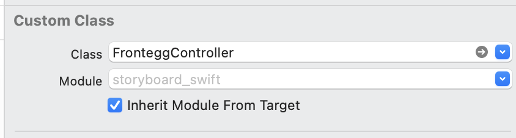
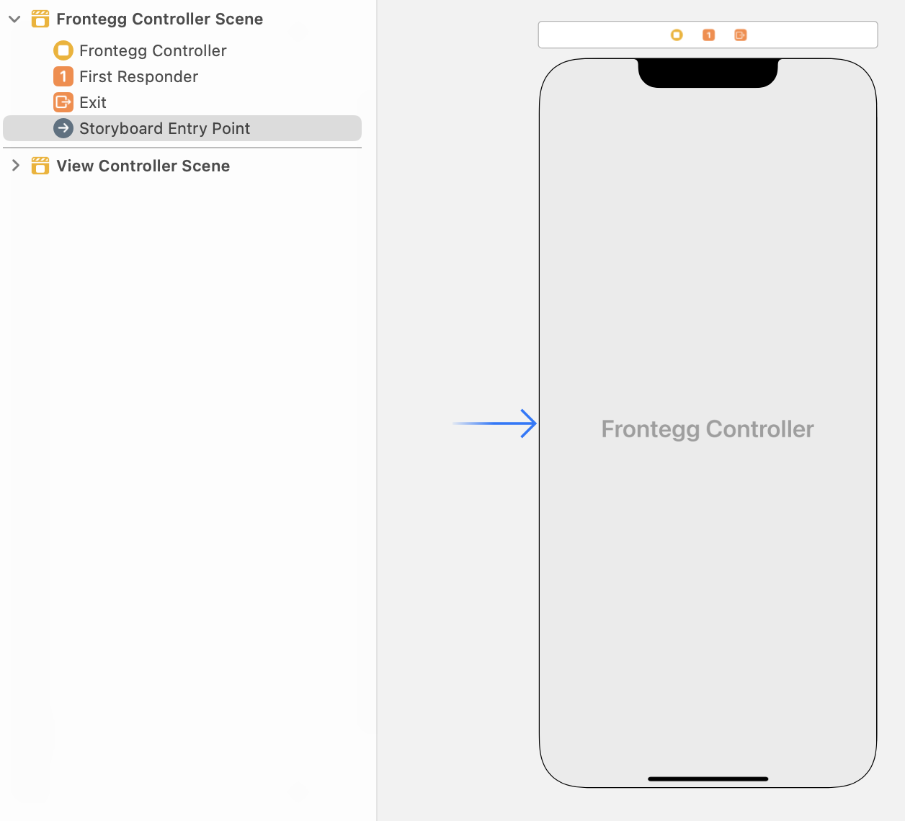

Frontegg is a web platform where SaaS companies can set up their fully managed, scalable and brand aware - SaaS features
and integrate them into their SaaS portals in up to 5 lines of code.

## Table of Contents

- [Project Requirements](#project-requirements)
  - [Supported Languages](#supported-languages)
  - [Supported Platforms](#supported-platforms)
- [Getting Started](#getting-started)
  - [Prepare Frontegg workspace](#prepare-frontegg-workspace)
  - [Setup Hosted Login](#setup-hosted-login)
  - [Add frontegg package to the project](#add-frontegg-package-to-the-project)
  - [Create Frontegg plist file](#create-frontegg-plist-file)
  - [SwiftUI Integration](#swiftui-integration)
    - [Add Frontegg Wrapper](#add-frontegg-wrapper)
    - [Add custom loading screen](#Add-custom-loading-screen)
  - [UIKit Integration](#uikit-integration)
    - [Add Frontegg UIKit Wrapper](#add-frontegg-uikit-wrapper)
    - [Add custom UIKit loading screen (coming-soon)](#Add-custom-uikit-loading-screen)
  - [Config iOS associated domain](#config-ios-associated-domain)

## Project Requirements

### Supported Languages

**Swift:** The minimum supported Swift version is now 5.3.

### Supported Platforms

Major platform versions are supported, starting from:

- iOS **> 14**


## Getting Started

### Prepare Frontegg workspace

Navigate to [Frontegg Portal Settings](https://portal.frontegg.com/development/settings), If you don't have application
follow integration steps after signing up.
Copy FronteggDomain to future steps from [Frontegg Portal Domain](https://portal.frontegg.com/development/settings/domains)

### Setup Hosted Login

- Navigate to [Login Method Settings](https://portal.frontegg.com/development/authentication/hosted)
- Toggle Hosted login method
- Add `{{IOS_BUNDLE_IDENTIFIER}}://{{FRONTEGG_BASE_URL}}/ios/oauth/callback`
- Replace `IOS_BUNDLE_IDENTIFIER` with your application identifier
- Replace `FRONTEGG_BASE_URL` with your frontegg base url


### Add frontegg package to the project

- Open you project
- Choose File -> Add Packages
- Enter `https://github.com/frontegg/frontegg-ios-swift` in search field
- Press `Add Package`


### Create Frontegg plist file

To setup your SwiftUI application to communicate with Frontegg, you have to create a new file named `Frontegg.plist` under
your root project directory, this file will store values to be used variables by Frontegg SDK: 

```xml
<?xml version="1.0" encoding="UTF-8"?>
<!DOCTYPE plist PUBLIC "-//Apple//DTD PLIST 1.0//EN" "http://www.apple.com/DTDs/PropertyList-1.0.dtd">
<plist version="1.0">
<dict>
	<key>baseUrl</key>
	<string>https://[DOMAIN_HOST_FROM_PREVIOUS_STEP]</string>
	<key>clientId</key>
	<string>[CLIENT_ID_FROM_PREVIOUS_STEP]</string>
</dict>
</plist>
```

### SwiftUI integration

- ### Add Frontegg Wrapper

  - To use Frontegg SDK you have to wrap you Application Scene with FronteggWrapper
      ```swift
    
      import SwiftUI
      import FronteggSwift
    
      @main
      struct demoApp: App {
          var body: some Scene {
              WindowGroup {
                  FronteggWrapper {
                      MyApp()
                  }
              }
          }
      }
      ```
  - Modify `MyApp.swift` file to render content if user is authenticated:
    1. Add `@EnvironmentObject var fronteggAuth: FronteggAuth` to
    2. Render your entire application based on `fronteggAuth.isAuthenticated`
  
    ```swift
    struct MyApp: View {
      @EnvironmentObject var fronteggAuth: FronteggAuth
      
      var body: some View {
        ZStack {
          if fronteggAuth.isAuthenticated {
            [YOU APPLICATION TABS / ROUTER / VIEWS]
          } else  {
            
            Button {
                fronteggAuth.login()
            } label: {
                Text("Login Button")
            }
          }
        }
      }
    }
    ```

  - ### Add custom loading screen

  To use your own `LoadingView` / `SplashScreen`:
  
  - Build your loading view in separated file
  - Pass `LoadingView` as AnyView to the FronteggWrapper
    ```swift
    FronteggWrapper(loaderView: AnyView(LoaderView())) {
      MyApp()
    }
    ```


### UIKit integration

- ### Add Frontegg UIKit Wrapper
  - Add Frontegg to the AppDelegate file
    ```swift
      func application(_ application: UIApplication, didFinishLaunchingWithOptions launchOptions: [UIApplication.LaunchOptionsKey: Any]?) -> Bool {
          // Override point for customization after application launch.
    
          FronteggApp.shared.didFinishLaunchingWithOptions()
        
          return true
      }
    ```
  - Create FronteggController class that extends AbstractFronteggController from FronteggSwift
    ```swift 
      //
      //  FronteggController.swift
      //
      
      import UIKit
      import FronteggSwift
      
      class FronteggController: AbstractFronteggController {
      
          override func navigateToAuthenticated(){
              // This function will be called when the user is authenticated
              // to navigate your application to the authenticated screen
              
              let mainStoryboard: UIStoryboard = UIStoryboard(name: "Main", bundle: nil)
              let viewController = mainStoryboard.instantiateViewController(withIdentifier: "authenticatedScreen")
              self.view.window?.rootViewController = viewController
              self.view.window?.makeKeyAndVisible()
          }
      
      }
    ```
  - Create new ViewController and set FronteggController as view custom class from the previous step
    
    
  - Mark FronteggController as **Storyboard Entry Point**
    
  
  - Setup SceneDelegate for Frontegg universal links:
      ```swift
        func scene(_ scene: UIScene, openURLContexts URLContexts: Set<UIOpenURLContext>) {
            if let url = URLContexts.first?.url,
                url.startAccessingSecurityScopedResource() {
                defer  {
                    url.stopAccessingSecurityScopedResource()
                }
                if url.absoluteString.hasPrefix( FronteggApp.shared.baseUrl ) {
                    if(FronteggApp.shared.auth.handleOpenUrl(url)){
                        // Display your own Authentication View Controller
                        // to handle after oauth callback
                        window?.rootViewController = AuthenticationController()
                        window?.makeKeyAndVisible()
                        return
                    }
                }
                
            }
        }
        func scene(_ scene: UIScene, continue userActivity: NSUserActivity) {
            if let url = userActivity.webpageURL {
                if(FronteggApp.shared.auth.handleOpenUrl(url)){
                    // Display your own Authentication View Controller
                    // to handle after oauth callback
                    window?.rootViewController = AuthenticationController()
                    window?.makeKeyAndVisible()
                    return
                }
            }
        }
      ```
  - Access authenticated user by `FronteggApp.shared.auth`
      ```swift
          
        //
        //  ExampleViewController.swift
        //
        
        import UIKit
        import SwiftUI
        import FronteggSwift
        import Combine
        
        
        class ExampleViewController: UIViewController {
        
            // Label to display logged in user's email
            @IBOutlet weak var label: UILabel!
            var showLoader: Boolean = true
            
            override func viewDidLoad() {
                super.viewDidLoad()
                // Do any additional setup after loading the view.
                
                // subscribe to isAuthenticated and navigate to login page
                // if the user is not authenticated
 
                let fronteggAuth = FronteggApp.shared.auth
                let sub = AnySubscriber<Bool, Never>(
                    receiveSubscription: {query in
                        query.request(.unlimited)
                    }, receiveValue: { showLoader in
                       self.showLoader = showLoader
                       self.label.text = fronteggAuth.user?.email ?? "Unknown"
                       
                       if(!showLoader && !fronteggAuth.isAuthenticated){
                           // Display your own Authentication View Controller
                           // to handle after oauth callback
                           window?.rootViewController = AuthenticationController()
                           window?.makeKeyAndVisible()
                           return .none
                       }
                       return .unlimited
                    })
      
                FronteggApp.shared.auth.$showLoader.subscribe(sub)
                
            }
             
            @IBAction func logoutButton (){
                FronteggApp.shared.auth.logout()
            }

        }
        
      ```


### Config iOS associated domain
Configuring your iOS associated domain is required for Magic Link authentication / Reset Password / Activate Account.

In order to add your iOS associated domain to your Frontegg application, you will need to update in each of your integrated Frontegg Environments the iOS associated domain that you would like to use with that Environment. Send a POST request to `https://api.frontegg.com/vendors/resources/associated-domains/v1/ios` with the following payload:
```
{
    “appId”:[YOUR_ASSOCIATED_DOMAIN]
}
```
In order to use our API’s, follow [this guide](‘https://docs.frontegg.com/reference/getting-started-with-your-api’) to generate a vendor token.
