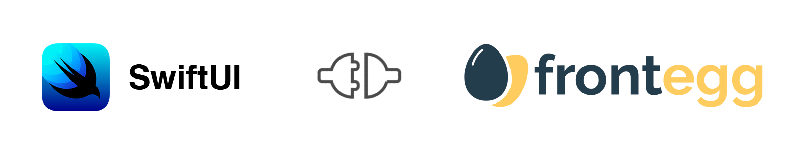
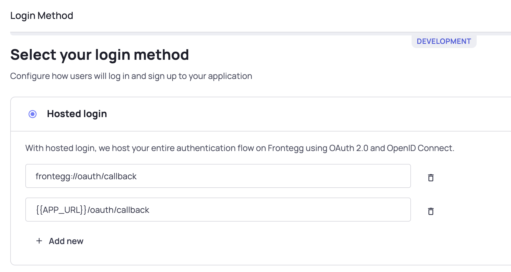

Frontegg is a web platform where SaaS companies can set up their fully managed, scalable and brand aware - SaaS features
and integrate them into their SaaS portals in up to 5 lines of code.

## Table of Contents

- [Project Requirements](#project-requirements)
  - [Supported Languages](#supported-languages)
  - [Supported Platforms](#supported-platforms)
- [Getting Started](#getting-started)
  - [Add frontegg package to the project](#add-frontegg-package-to-the-project)
  - [Prepare Frontegg workspace](#prepare-frontegg-workspace)
  - [Create Frontegg plist file](#create-frontegg-plist-file)
  - [Add Frontegg Wrapper](#add-frontegg-wrapper)
  - [Add your custom loading screen](#Add-your-custom-loading-screen)
  - [Config iOS associated domain](#config-ios-associated-domain)

## Project Requirements

### Supported Languages

**Swift:** The minimum supported Swift version is now 5.3.

### Supported Platforms

Major platform versions are supported, starting from:

- iOS **14**

[//]: # (- macOS **12**)

[//]: # (- tvOS **14** )

[//]: # (- watchOS **7**)


## Getting Started

### Add frontegg package to the project

- Open you project
- Choose File -> Add Packages
- Enter `https://github.com/frontegg/frontegg-ios-swift` in search field
- Press `Add Package`

### Prepare Frontegg workspace

Navigate to [Frontegg Portal Settings](https://portal.frontegg.com/development/settings), If you don't have application
follow integration steps after signing up.


### Setup Hosted Login oauth callback

- Navigate to [Frontegg Login Methods](https://portal.frontegg.com/development/authentication/hosted),
- Add new redirect url `frontegg://oauth/callback`
   


### Create Frontegg plist file

To setup your SwiftUI application to communicate with Frontegg, you have to create a new file named `Frontegg.plist` under
your root project directory, this file will store values to be used variables by Frontegg SDK: 

```xml
<?xml version="1.0" encoding="UTF-8"?>
<!DOCTYPE plist PUBLIC "-//Apple//DTD PLIST 1.0//EN" "http://www.apple.com/DTDs/PropertyList-1.0.dtd">
<plist version="1.0">
<dict>
	<key>baseUrl</key>
	<string>https://[DOMAIN_HOST_FROM_PREVIOUS_STEP]</string>
	<key>clientId</key>
	<string>[CLIENT_ID_FROM_PREVIOUS_STEP]</string>
</dict>
</plist>
```

### Add Frontegg Wrapper

- To use Frontegg SDK you have to wrap you Application Scene with FronteggWrapper
    ```swift
    
    import SwiftUI
    import FronteggSwift
    
    @main
    struct demoApp: App {
        var body: some Scene {
            WindowGroup {
                FronteggWrapper {
                    MyApp()
                }
            }
        }
    }
    ```
- Modify `MyApp.swift` file to render content if user is authenticated:
  1. Add `@EnvironmentObject var fronteggAuth: FronteggAuth` to
  2. Render your entire application based on `fronteggAuth.isAuthenticated`
  
  ```swift
  struct MyApp: View {
    @EnvironmentObject var fronteggAuth: FronteggAuth
      
    var body: some View {
      ZStack {
        if fronteggAuth.isAuthenticated {
          [YOU APPLICATION TABS / ROUTER / VIEWS]
        } else  {
          FronteggLoginPage()
        }
      }
    }
  }
  ```

    
### Add your custom loading screen

To use your own `LoadingView` / `SplashScreen`:

- Build your loading view in separated file
- Pass `LoadingView` as AnyView to the FronteggWrapper
  ```swift
  FronteggWrapper(loaderView: AnyView(LoaderView())) {
    MyApp()
  }
  ```


### Config iOS associated domain

Contact Frontegg Support for adding iOS associated domain to your Frontegg application,
This config is necessary for Magic Link authenticated / Reset Password / Activate Accounts
